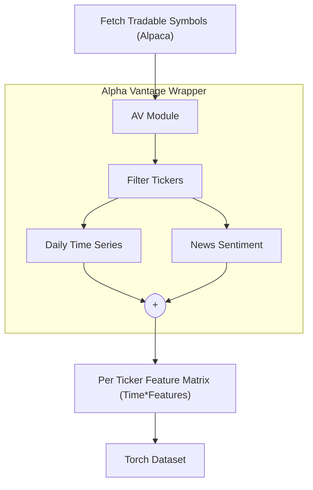

# Stock Solver
[](LICENSE)
[](#current-progress)
[](pyproject.toml)

<!-- TODO: Rephrase this to be "within the scope of minimal demo" -->
Toy project to predict and analyze stock market. The current implementation covers data collection, dataset construction, and an Informer-based model built with PyTorch. All components are implemented from scratch for learning purposes.

# Overview and Goals

- **Data** - We collect data from [Alpha Vantage](https://www.alphavantage.co/) via a simple API wrapper we implemented. We collect daily time series (OCHLV values), news sentiment scores, and insider trading data for selected tickers. We combine everything into a neat PyTorch Dataset.
- **Model** - We wanted to implement a Deep Learning model for predicting Closing Prices few days into the future. Since, this is a Seq2Seq problem, we landed on using Transformer architecture, more specifically an Informer architecture introduced in this [paper](https://arxiv.org/abs/2012.07436). This could be not the state-of-the-art approach, but for the sake of this scope, we think this is a great choice.

## Current Progress
- [x] **Data access**:
    - [x] [Time Series endpoint](https://www.alphavantage.co/documentation/#daily)
    - [x] [News Sentiment endpoint](https://www.alphavantage.co/documentation/#news-sentiment)
    - [x] [Insider Transactions endpoint](https://www.alphavantage.co/documentation/#insider-transactions) (Available, but not used anywhere)
    - [x] [Company Overview endpoint](https://www.alphavantage.co/documentation/#company-overview)
- [x] **Populating the Dataset**:
    - [x] Basic preprocessing and aggregation of the features
    - [x] Per-ticker normalization
    - [x] "Unrolled" torch dataset
- [x] **Model Implementation**:
    - [x] Encoder
    - [x] Decoder
    - [x] Distillation
    - [x] ProbSparse Attention
    - [x] Embedding
- [ ] **Model Evaluation**:

## Data Pipeline
Our approach for the data pipeline is quite straightforward and can be depicted below. 

First, we obtain the list of available tickers using [Alpaca API](https://alpaca.markets/) to gain an initial list of active tickers in the US market. However, using this approach alone, leaves us with almost 13,000 tickers. We further filter the list of tickers using Company Overview endpoint provided by [Alpha Vantage](https://www.alphavantage.co/). The filer keeps only common stocks (no cryptocurrencies) with a minimum market capitalisation of 1,000,000,000$. This leaves us with around 2,000 tickers. For each ticker we collect the data by calling Daily Time Series and News Sentiment endpoints. The time series endpoint returns all the available information in one call. The news sentiment endpoint supports the call for given time windows, but it does not work as expected for long periods of time, as the results are intraday and the number of news per request is quite limited. Therefore, we iterate using smaller time windows and aggregate the results over the day.

### Building per-ticker feature matrices

Each ticker is processed independently through `build_features_for_ticker` in `src/stock_solver/dataset/apis/alpha_vantage_calls.py`. The function downloads the daily OHLCV series and daily aggregates of the news sentiment feed. The two sources are joined on the trading day to produce a **feature matrix** of shape `[#days, #features]`

Once the matrix is constructed, it is written to `<dataset_path>/<TICKER>.parquet`. We additionally maintain  a `manifest.json` file inside the dataset folder with the list of exported tickers and the corresponding parquet file names. 

### "Unrolling" the data into a PyTorch Dataset
The `MultitickerDataset` class in `src/stock_solver/dataset/dataset.py` converts the ticker to feature matrix dictionary into an "unrolled" pytorch dataset. For each ticker we:

1. Select the feature columns
2. Select the target column
3. Enumerate all valid sliding windows of length `lookback + horizon`. Every window is represented by a `WindowIndex` that stores the ticker id and star index.

In `__getitem__` we use the `WindowIndex` to pull the feature block and the associated calendar features. Encoding (`enc_marks`) and decoding (`dec_marks`) date markers are derived from the original trading calendar and expanded into `[month, day, weekday]` integers. Training batches therefore return:
```
((X_indow, enc_marks), (y_future, dec_marks), ticker_id)
```
The test batches drop `y_future` but still keep the `dec_marks` as it is a known info.

## Getting Started
1. Clone the repository
    ``` bash
    git clone https://github.com/KYZZHECIK/stock_solver.git && cd stock_solver
    ```
2. Install dependencies. We use [Poetry](https://python-poetry.org/docs/) as our dependencies manager.
    ``` bash
    poetry install
    ```
3. Set environment variables for accessing the APIs.
    
    Create a `.env` file containing your Alpha Vantage API key.
    ``` bash
    ALPHA_VANTAGE_API_KEY="your_key"
    ```
    Additionally, if Alpaca API is also needed, append the necessary keys to `.env`.
    ``` bash
    ALPACA_SECRET_KEY="your_secret_key"
    ALPACA_API_KEY="your_key"
    ```

4. Run.

    For obtaining filtered list of tickers, run:
    ``` bash
    python -m src.stock_solver.dataset.apis.get_tickers --path=...
    ```
    The command above calls Alpaca API to obtain the available tickers, filters using Alpha Vantage Overview endpoint, and saves the tickers to the specified path. If there is a predetermined list of tickers available, this step can be skipped.

    For obtaining the data necessary for the dataset, run:
    ``` bash
    python -m src.stock_solver.dataset.apis.alpha_vantage_calls --tickers_path=... --dataset_path=...
    ```
    The command calls the endpoints and aggregates the features for each ticker from the `--tickers_path` file. The features for each ticker are saved in the `--dataset_path` folder along with an updated manifest that tracks which symbols were exported.