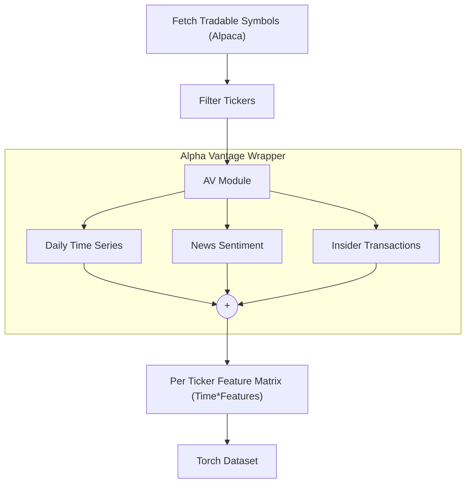

# Stock Solver
[](LICENSE)
[](#current-progress)
[](pyproject.toml)

Toy project to predict and analyze stock market. Currently under active development. The pipeline covers data collection, dataset construction, and an Informer-based model built with PyTorch. All components are implemented from scratch for learning purposes.

---

# Overview and Goals

- **Data** - We collect data from [Alpha Vantage](https://www.alphavantage.co/) via a simple API wrapper we implemented. We collect daily time series (OCHLV values), new sentiment scores, and insider trading data for selected tickers. We combine everything into a neat PyTorch Dataset.
- **Model** - We wanted to implement a Deep Learning model for predicting Closing Prices few days into the future. Since, this is a Seq2Seq problem, we landed on using Transformer architecture, more specifically an Informer architecture introduced in this [paper](https://arxiv.org/abs/2012.07436). This could be not the state-of-the-art approach, but for the sake of this scope, we think this is a great choice.

## Current Progress
- [x] **Data access**:
    - [x] [Time Series endpoint](https://www.alphavantage.co/documentation/#daily)
    - [x] [News Sentiment endpoint](https://www.alphavantage.co/documentation/#news-sentiment)
    - [x] [Insider Transactions endpoint](https://www.alphavantage.co/documentation/#insider-transactions)
- [ ] **Populating the Dataset**:
    - [x] Basic preprocessing and aggregation of the features
    - [ ] Per-ticker normalization
- [ ] **Model Implementation**:
    - [x] Encoder
    - [x] Decoder
    - [x] Distillation
    - [x] ProbSparse Attention
    - [x] Embedding
- [ ] **Model Evaluation**:

## Data Pipeline


## Getting Started
1. Clone the repository
``` bash
https://github.com/KYZZHECIK/stock_solver.git
cd stock_solver
```

2. Install dependencies ([Poetry](https://python-poetry.org/docs/) recommended)
``` bash
poetry install
```

3. Set environment variables (For accessing the APIs).
    - Create a `.env` file containing your Alpha Vantage API key.
    ``` bash
    ALPHA_VANTAGE_API_KEY="your_key"
    ```

4. Run
    - **TODO**
